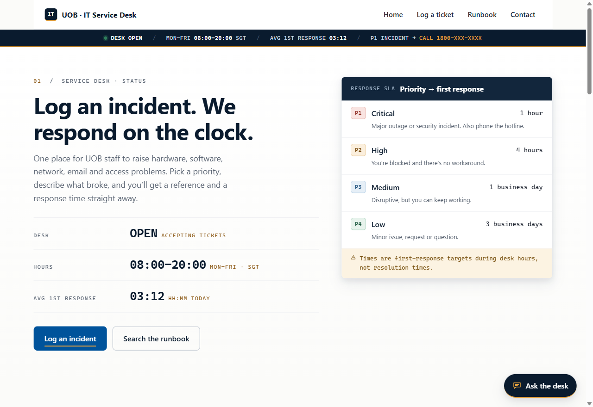

# UOB · IT Service Desk (training demo)

A single-page training/demo mockup of an internal IT Support Service Desk, themed
as "UOB Bank". It is a teaching artifact, not a real product — all names, phone
numbers, email domains (`@uobgroup.com`), SLAs, and FAQ content are fictitious.

**Training demo — not affiliated with or endorsed by United Overseas Bank Limited.**

## Live demo

https://twm1909.github.io/itsupport/

## Running locally

The entire site is `index.html`. Open it directly in a browser — double-click it,
or `Start-Process index.html` (Windows) / `open index.html` (macOS). There is no
build step, package manager, or dependency, and it works from a `file://` URL.

## What's inside

- **Header** — sticky nav (mobile hamburger) plus a persistent monospace
  desk-status strip (hours, average first-response, P1 hotline).
- **Hero** — the desk's response commitment as a "docket", next to a
  priority → first-response SLA reference card.
- **Incident intake form** — inline validation on blur and submit, a focusable
  error summary, a step rail (who / what / confirm), priority as a triage scale
  with per-tier SLA budgets, live character counters, attachment filename display,
  and a non-blocking credential-safety warning. A clean submit generates a mock
  reference `UOB-ITSD-YYYYMMDD-####` and shows the matching SLA.
- **Self-service runbook** — eight one-at-a-time accordion entries with live
  text search.
- **Service desk assistant** — a scripted, offline chat widget (no network, no
  account data) that answers the same ground as the runbook, guards against pasted
  credentials, and can hand off to the ticket form with a category pre-selected.
- **Footer** — navigation, contact details, a "the desk will never ask for your
  password" security notice, and the disclaimer.

## Constraints (kept deliberately)

- **One self-contained file.** All CSS is in the single `<style>` block; all JS is
  in the single `<script>` block. No frameworks, no external URLs, no build tooling.
- **No persistence, no network.** Submitted tickets live only in the in-memory
  `submittedTickets` array — no `localStorage`, `sessionStorage`, or requests.
- **Never collects credentials.** No password / OTP / PIN / card-number fields; the
  description field and the chat assistant both warn if the user types something
  credential-like.
- **Locked down.** A restrictive `Content-Security-Policy` meta tag blocks every
  external request and form submission; `robots` is set to `noindex`.

## Deployment

`.github/workflows/deploy.yml` publishes the repository root to GitHub Pages on
every push to `main` (source: GitHub Actions).
